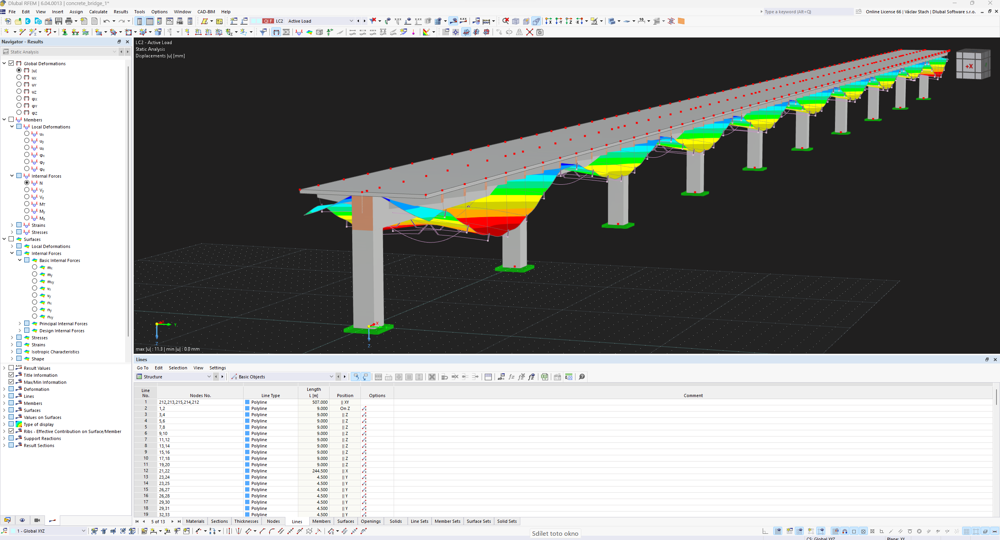

# Script for generating basic concrete bridge
script generates simple bridge structure based on provided parameters

there are two groups of parameters:

-primary parameters - general dimensions of the structure, load magnitude

-secondary parameters - that are by default derived from the primary parameters, but can be adjusted manually

One loadcase is generated as a "live load" that can be adjusted to act on whole bridge or on alternating bridge fields.

There is no GUI or terminal input provided, parameters are meant to be changed in the script itself and then run.

