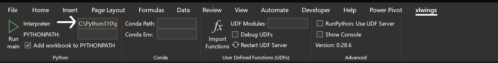
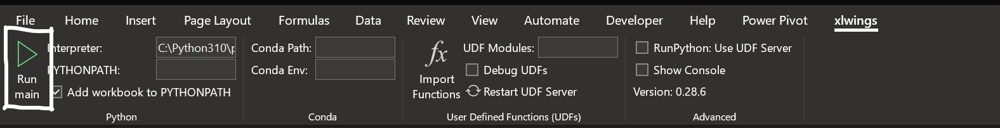

# Steel Design Excel Integration

Python version : Python 3.10 (recommended)  
*Note: `xlwings` is not supported by `Python 3.11` at the moment.*

## Step by step guide

Here, you can  find the step by step process to use Steel Design Example using MS Excel.

1. [Install pandas](https://pandas.pydata.org/pandas-docs/stable/getting_started/install.html)
2. [Install xlwings](https://docs.xlwings.org/en/stable/installation.html#id2)
3. [Install xlwings Add-in](https://docs.xlwings.org/en/stable/installation.html#add-in)
4. Add Python Interpreter
5. Run the Script

## Installing pandas

pandas can be installed via pip from [PyPI](https://pypi.org/project/pandas/).

> ``🛈`` **Note**:      
You must have `pip>=19.3` to install from PyPI.

```
pip install pandas
```

Python version support : Officially Python 3.8, 3.9, 3.10 and 3.11.

## Installing xlwings

xlwings comes pre-installed with

* [Anaconda](https://www.anaconda.com/products/distribution) (Windows and macOS)

* [WinPython](https://winpython.github.io/) (Windows only) Make sure not to take the dot version as this only contains Python.

You can also install it with pip:

```
pip install xlwings
```

or conda:
```
conda install xlwings
```

## Installing xlwings Add-in

To install the add-in, use the command line client:
```
xlwings addin install
```

> ``🛈`` **Note**:      
The ribbon of the add-in is compatible with Excel >= 2007 on Windows and >= 2016 on macOS. On macOS, all UDF related functionality is not available.


> ``🛈`` **Note**:      
The add-in is password protected with the password `xlwings`. For debugging or to add new extensions, you need to unprotect it. Alternatively, you can also install the add-in via `xlwings addin install --unprotected`.

## Adding Python Interpreter

Add your local ``python.exe`` path into interpreter in xlwings tab.

For example : ``C:\Python310\python.exe``



## Run the Script

To run the python code press ``Run main`` in xlwings ribbon.


